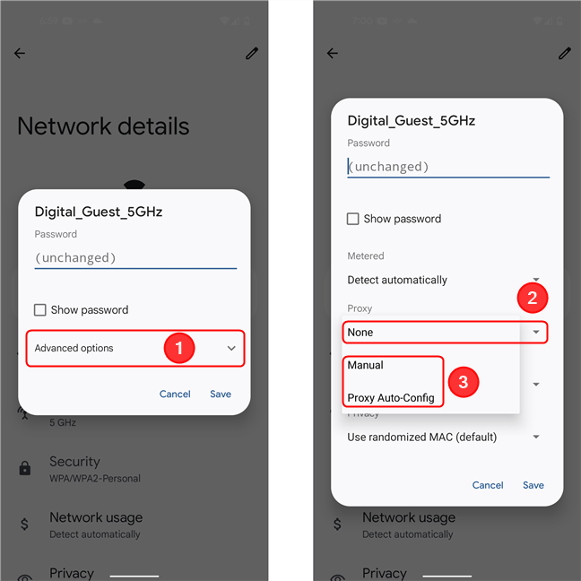

---
hide:
  - navigation
---

# Reverse Engineering Android Apps

Any Android app that makes HTTPS API requests (in this case to the myVAILLANT API), can be reverse engineered
with an Android device and a laptop / PC that runs ADB. Both need to be on the same network.
Creating a hotspot from the Android device also works.

1. [Run mitmproxy](https://docs.mitmproxy.org/stable/overview-installation/) on your laptop, for example in Docker: 
   ```shell
   docker run --rm -it -v ~/.mitmproxy:/home/mitmproxy/.mitmproxy -p 0.0.0.0:8080:8080 -p 127.0.0.1:8081:8081 mitmproxy/mitmproxy mitmweb --web-host 0.0.0.0
   ```
2. In your Android WI-FI settings (see screenshot below) set a manual proxy to the IP of the device running mitmproxy on port 8080.
   Add a bypass for `identity.vaillant-group.com`[^1]
3. Visit [mitm.it](http://mitm.it/) on your Android device, download the CA cert & install it through the settings app
4. Install [ADB](https://www.xda-developers.com/install-adb-windows-macos-linux/) on your laptop and connect your Android device to USB in debug mode
5. Look for the myVAILLANT APK online and download it
6. Run [apk-mitm](https://github.com/shroudedcode/apk-mitm) on the APK and install it with adb

       ```bash
       apk-mitm myVAILLANT.xapk
       unzip ./myVAILLANT-patched.xapk
       adb install-multiple com.vaillantgroup.enduserapp.vaillant.apk config.mdpi.apk config.fr.apk config.en.apk config.arm64_v8a.apk
       ```

7. You should see all API calls in mitmproxy's web interface on [http://127.0.0.1:8081](http://127.0.0.1:8081) now. 
   
!!! note

    If you can't log in with SSO because of a certificate error, make sure you added the exception to the proxy settings.

    If you can log in, but the app reports an error, the unpinning didn't work.
    You can try [MagiskTrustUserCertson](https://github.com/NVISOsecurity/MagiskTrustUserCertson) if you have a rooted Android device.

<figure markdown>
  
  <figcaption><a target="_blank" href="https://www.digitalcitizen.life/how-add-proxy-server-wireless-connection-android/">Source: digitalcitizen.life</a></figcaption>
</figure>

[^1]: The single-sign on gets handled in your browser, which uses certificate pinning as an added security measure